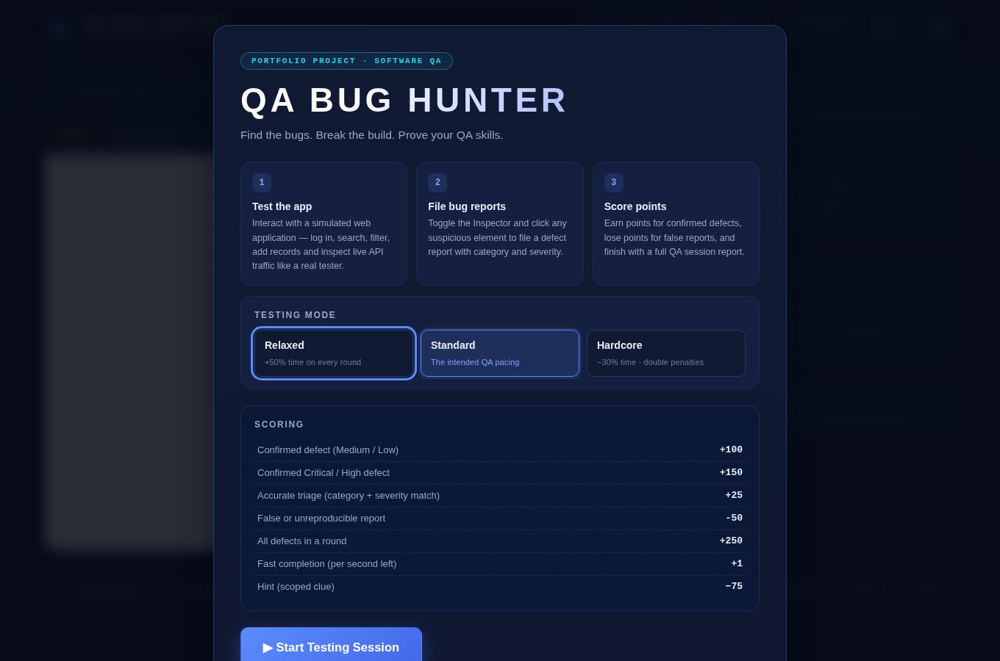
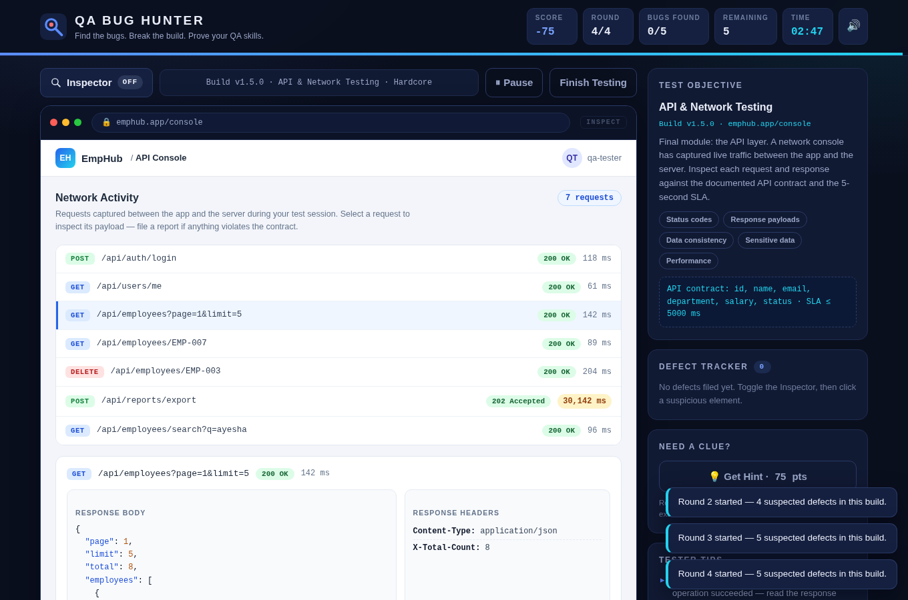
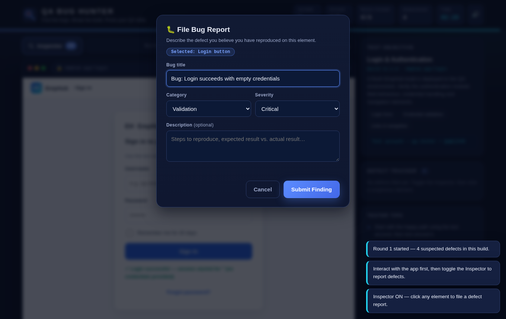
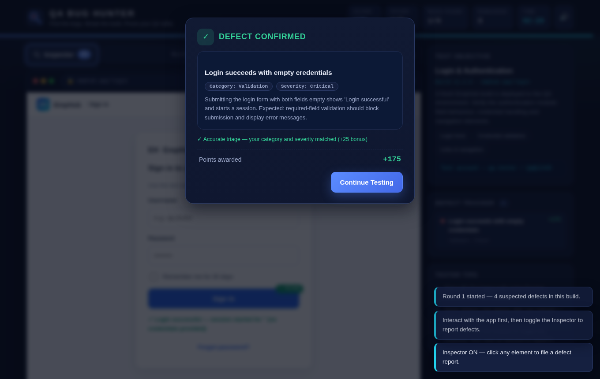
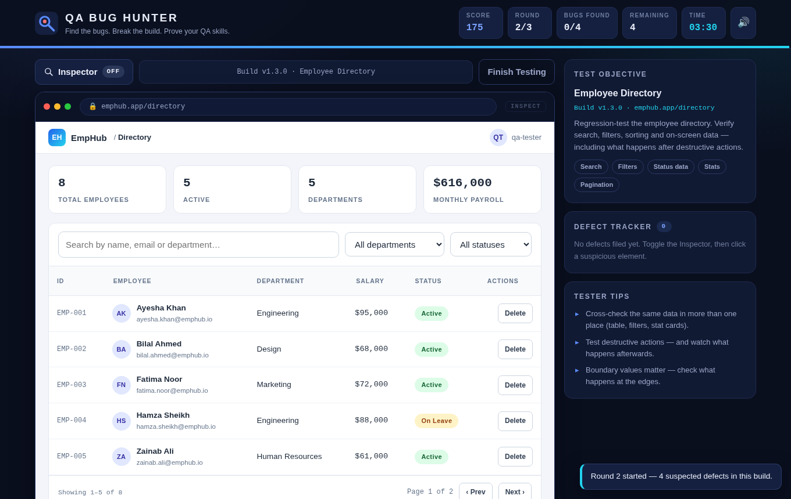
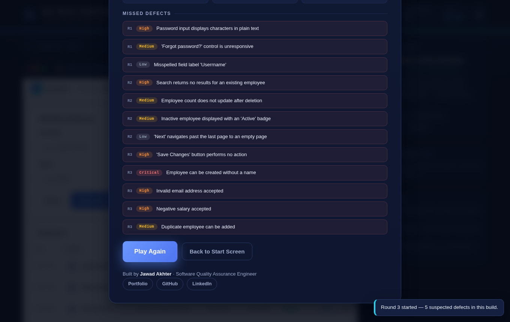

# 🐛 QA Bug Hunter

**A browser-based QA testing game — find the bugs, break the build, prove your QA skills.**

> You are a Software QA Engineer. A simulated web application (*EmpHub — Employee Management System*) has been deployed to a QA environment with **seeded defects**. Test it like a real tester: explore the app, reproduce defects, file bug reports, and finish with a professional QA session report.

**▶ Play it live:** <https://jd577.github.io/qa-bug-hunter-game/>

---

## 📸 Screenshots

| Start screen & testing modes | Round 4 — API & Network Testing |
|---|---|
|  |  |

| Filing a bug report | Confirmed defect |
|---|---|
|  |  |

| Employee directory (Round 2) | Final QA report |
|---|---|
|  |  |

---

## 📋 Project Overview

QA Bug Hunter is an interactive portfolio project built by a Software Quality Assurance Engineer to demonstrate practical testing thinking — not just theory. Instead of reading about test techniques, visitors *experience* them: they must interact with an application under test, reproduce functional/validation/UI/data defects, triage them by category and severity, and are scored on precision, not luck.

Everything runs **100% client-side**. There is no backend, no database, no login and no external service — the game works by simply opening `index.html`.

---

## ✨ Features

- **4 testing rounds** with rising difficulty — Login & Authentication, Employee Directory, Form Validation & Data Handling, and **API & Network Testing**
- **18 realistic seeded defects** (functional, validation, UI, data, security and performance) — never revealed upfront
- **API testing round** — inspect captured HTTP traffic in a network console: status-code mismatches, contract violations, sensitive-data exposure and SLA breaches
- **3 testing modes** — Relaxed (more time), Standard, Hardcore (tighter timer, double penalties)
- **Interactive application under test** — a fully working simulated app where bugs must be *reproduced*, not just spotted
- **Inspector mode** — toggle it and click any element to file a structured bug report (title, category, severity, description)
- **Hint system** — spend points for a scoped clue when you're stuck (never the exact element)
- **Pause** — stop the clock mid-round (`P`); the timer also pauses automatically while you write a bug report
- **Realistic scoring** — points for confirmed defects, penalties for false reports, triage and speed bonuses
- **Per-round countdown timer** with progress bar and warning states
- **Final QA report** — score, accuracy, per-category performance, missed defects, a session verdict and a copyable session summary
- **Personal best & session history** — stored locally in your browser only (no accounts, no servers, no tracking)
- **Defect tracker panel** — confirmed bugs appear live with severity indicators
- Dark professional QA-dashboard UI wrapping a light enterprise app
- Fully responsive (desktop / laptop / tablet / mobile), keyboard accessible, `prefers-reduced-motion` aware
- Subtle optional sound effects synthesized with the Web Audio API (no audio files) with an ON/OFF control
- Full replay support — **Play Again** resets everything without a page refresh

---

## 🛠️ Technologies

| Technology | Purpose |
|---|---|
| HTML5 | Semantic structure, accessible dialogs and controls |
| CSS3 | Custom properties, grid/flex layouts, animations, responsive design |
| Vanilla JavaScript (ES2020) | Game engine, simulated app logic, scoring, timer, Web Audio sounds |

No frameworks, no build step, no dependencies, no network calls.

**Privacy:** the game runs 100% in your browser. It makes **zero network requests** — no analytics, no tracking, no accounts. Session history and preferences are stored only in your own browser's `localStorage` and never leave your device.

---

## 🚀 How to Run

**Option 1 — just open it**

1. Download or clone the repository
2. Double-click `index.html` (or drag it into any modern browser)

**Option 2 — clone**

```bash
git clone https://github.com/jd577/qa-bug-hunter-game.git
cd qa-bug-hunter-game
# open index.html in your browser
```

**Option 3 — GitHub Pages**

1. Push the repository to GitHub
2. Settings → Pages → Deploy from branch → `main` / root
3. Your game is live at `https://<username>.github.io/qa-bug-hunter-game/`

---

## 🎮 How the Game Works

### The loop

1. **Start a testing session** — each round is a new *build* of the EmpHub app with its own test brief
2. **Interact with the application under test** — log in, search, filter, sort, delete, add and edit records. Some defects only become reproducible after specific actions
3. **Toggle the Inspector** (toolbar button or press `I`), then click any element you suspect
4. **File a bug report** — pick a category and severity, describe the issue, submit
5. **Get judged** — confirmed defects award points; unreproducible or false reports cost points
6. **Round summary → final QA report** — see found/missed defects, accuracy and a performance verdict

### Scoring

| Event | Points |
|---|---|
| Confirmed defect (Medium / Low severity) | **+100** |
| Confirmed Critical / High severity defect | **+150** |
| Accurate triage (your category + severity match the actual defect) | **+25** |
| False or unreproducible report | **−50** (doubled in Hardcore) |
| All defects found in a round | **+250** |
| Fast completion (per second remaining, when all defects are found) | **+1 / sec** |
| Hint (scoped clue) | **−75** |

### Rounds

| Round | Module | What you test |
|---|---|---|
| 1 | Login & Authentication | Field behaviour, credential validation, navigation elements |
| 2 | Employee Directory | Search, filters, sorting, data accuracy, destructive actions, pagination |
| 3 | Form Validation & Data Handling | Required fields, negative input, invalid formats, duplicates, edit flow |
| 4 | API & Network Testing | Status codes vs. response bodies, contract compliance, sensitive-data exposure, response-time SLAs |

### Testing modes

| Mode | Timer | Penalties |
|---|---|---|
| Relaxed | +50% time per round | standard |
| Standard | intended pacing | standard |
| Hardcore | −30% time per round | double |

---

## 🧪 QA Concepts Demonstrated

| In-game mechanic | QA concept |
|---|---|
| Exploring the simulated app before reporting | Exploratory testing |
| Following each round's brief and scope | Test planning / test scope |
| Trying empty, invalid and extreme values | **Negative testing**, boundary value analysis |
| Checking badges, counts and labels against filters | **UI testing**, data validation |
| Deleting / adding records and observing state | Functional & regression testing |
| Reports only count once the defect is reproduced | Defect reproduction & evidence |
| Choosing category + severity for each report | Bug triage / severity assessment |
| Writing title + description in the report | Defect reporting & documentation |
| Losing points for unverifiable reports | False positives & report quality |
| Cross-checking the same data in two places | Consistency / oracle thinking |
| Every element is clickable and testable | User interaction testing, attention to detail |
| Inspecting captured requests and payloads | **API testing**, contract verification |
| Spotting 200-OK responses that actually failed | Status-code / error-handling validation |
| Finding exposed `passwordHash` in a payload | Sensitive-data / security testing |
| Checking response times against an SLA | Performance & non-functional testing |
| Round summaries listing missed defects | Test retrospectives / coverage gaps |

---

## 📁 Project Structure

```text
qa-bug-hunter-game/
│
├── index.html          # Game shell: header, HUD, AUT frame, panels, overlays
├── css/
│   └── style.css       # Dark QA-dashboard theme + light "app under test" styles
├── js/
│   └── game.js         # Config, sound engine, round/bug definitions, game logic
├── assets/
│   └── screenshots/    # README screenshots (the game itself needs no assets)
└── README.md
```

The code is organised in clearly banner-commented sections (configuration, utilities, sound, data, bug/round definitions, HUD, dialogs, timer, inspector, AUT renderers, scoring, round flow, init) so another developer can navigate it easily.

---

## ⚙️ Configuration

Everything you may want to change lives in a single `CONFIG` object at the top of `js/game.js`:

```js
const CONFIG = {
  profile: {
    name: 'Jawad Akhter',
    role: 'Software Quality Assurance Engineer',
    links: {
      portfolio: 'https://jd577.github.io/portfolio/',
      github:    'https://github.com/jd577',
      linkedin:  'https://www.linkedin.com/in/jawad-akhter',
    },
  },
  scoring: { correct: 100, correctHigh: 150, incorrect: -50, ... },
};
```

The footer, start screen and results screen all render their links from this one object — update it once and you are done. Scoring values, round durations and the seeded bug list (also in `js/game.js`, `ROUNDS`) are equally easy to tune.

---

## ♿ Accessibility & UX Notes

- Real `<button>`, `<select>`, `<label>` elements throughout; visible `:focus-visible` states
- Inspector targets become keyboard-focusable with `role="button"` while Inspector mode is on; activate with `Enter` / `Space`
- Dialogs use `role="dialog"`, `aria-modal`, focus trapping and `Escape` to cancel
- Keyboard shortcuts: `I` toggles the Inspector, `P` pauses/resumes the session
- Toasts and app status lines announce via `aria-live`
- All player-typed input is HTML-escaped (yes — we tried the XSS payloads too 😄)
- `prefers-reduced-motion` disables non-essential animation
- Responsive down to small phones with no horizontal overflow; touch-friendly targets

---

## 🔭 Future Improvements

- Additional modules (reporting dashboard, file upload, rate-limit handling)
- Localizable strings and more seeded-defect packs contributed via a simple JSON schema
- Optional automated test suite (e.g., Playwright) run via GitHub Actions

---

## 👤 Author

**Jawad Akhter** — Software Quality Assurance Engineer

- Portfolio: <https://jd577.github.io/portfolio/>
- GitHub: <https://github.com/jd577>
- LinkedIn: <https://www.linkedin.com/in/jawad-akhter>

---

*This project is intentionally defect-rich — that is the whole point. 🐛*
